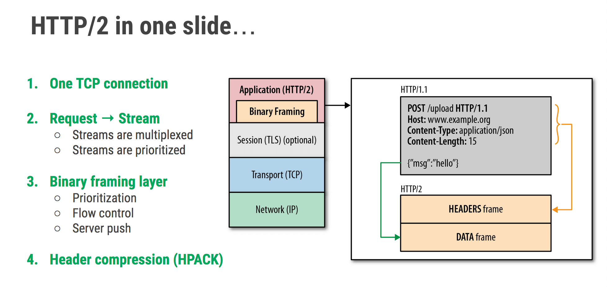
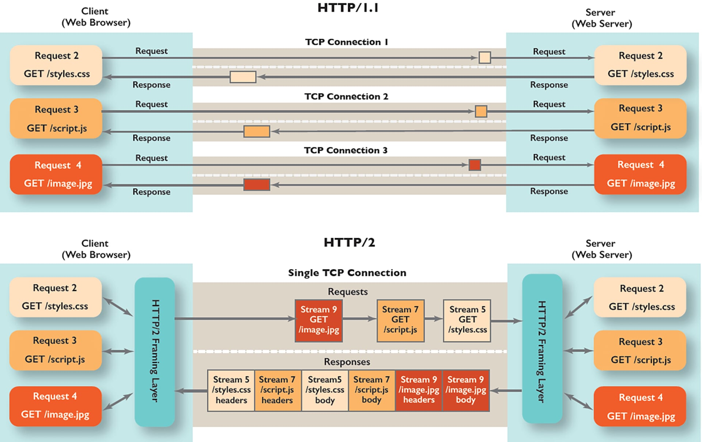
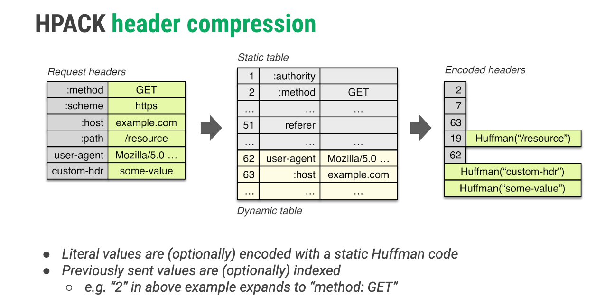
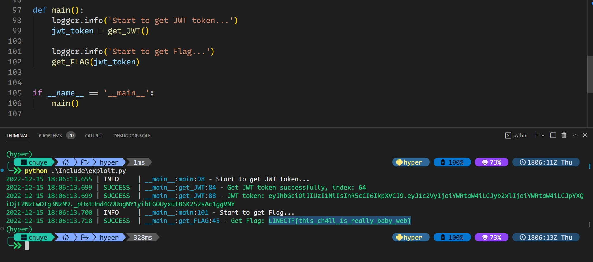

## References

- [@童话, HTTP/2 Header Field Re-used Attack Trick, 2021-03-29](https://tonghuaroot.com/2021/03/29/HTTP-2-Header-Field-Re-used-Attack-Trick/)
- [Team The Duck(1st place) LINE CTF 2021 Write Up](https://github.com/theori-io/ctf/blob/master/2021/linectf/LINE CTF 2021 Write Up - The Duck.pdf)
- [Team KimchiSushi(2nd place) LINE CTF Writeup](https://hackmd.io/@stypr233/linectf), seem 404: [WebArchive Link](https://web.archive.org/web/20220125134257/https://hackmd.io/@stypr233/linectf)

**Tag: HTTP/2 Protocol, HPACK, Header reuse**

1.题目功能点很少，可以直接看看提供的源码。在 docker-compose 中通过 `expose` 和 `ports` 暴露了几个端口，根据[文档](https://docs.docker.com/compose/compose-file/compose-file-v3/)：

> `expose`: Expose ports without publishing them to the host machine - they’ll only be accessible to linked services. Only the internal port can be specified.
>
> `ports`: Expose ports. Either specify both ports (`HOST:CONTAINER`), or just the container port (a random host port will be chosen).

所以主要关注 httpd 服务，根据 httpd.conf 文件内容可知其是一个反向代理：

```ini
<VirtualHost *:80>
    ...
    ProxyRequests Off
    ProxyPreserveHost On
    ProxyPass / http://babyweb_public:12000/
    ProxyPassReverse / http://babyweb_public:12000/
</VirtualHost>
```

将请求转发到后端的 `http://babyweb_public:12000/` 中。再根据环境变量的设置可知 babyweb_public 部分功能依赖 babyweb_internal，并且 FLAG 设置在后者的环境变量中。

继续看 public 和 internal 部分的源码：public 是基于 Flask 开发的 Web 应用，internal 是一个 Node.js 应用。在 internal 中的 `router.js` 文件可以很明显看到获取 flag 的逻辑：

```js
// https://babyweb_internal:8443/flag
export function router (req, res, path) {
    switch(path) {
        case '/auth':
            auth(req, res)
            break;
    	case '/flag':
			getFlag(req, res)
            break;
        default:
            res.end(JSON.stringify({"result": false}))
            break;
    }
}

const getFlag = (req, res)=> {
    let token = req.headers['x-token']  // 在请求头中携带 admin 的 x-token 信息即可获取
    if(checkToken(token)) {             // if(decode(token)["role"] === 'admin')
        res.end(JSON.stringify({'result': true, 'flag': CONFIG.flag}))
    } else {...}
}
```

而另一个 `/auth` 路由，则是当请求头中携带正确的用户名和密码信息，会生成 admin 角色的 JWT token 并返回：

```js
const auth = (req, res) => {
    let _username = req.headers[CONFIG.header.username]
    let _password = req.headers[CONFIG.header.password]
    res.end(JSON.stringify(authCheck(_username, _password)))
}

const authCheck = (username, password) => {
    let result = false;
    let token = ''
    if(username === CONFIG.admin.username && password === CONFIG.admin.password){
        result = true
        token = encode({user: username, role: 'admin'})
    }
    return {result, token}
}
```

这些值都是在环境变量中通过 `uuid4()` 随机生成的，所以再看看 public 服务是如何请求的。其与 internal 服务的交互写在了 `internal.py` 文件中，通过 [Blueprints](https://flask.palletsprojects.com/en/2.2.x/blueprints/) 注册了两个 internal 相关的路由，分别为 `/internal/auth` 和 `/internal/health`

auth 很简单，就是通过 POST 传用户名和密码来校验并生成 JWT，所以可以直接跳过。另一个路由会根据传参 type 是 1.1 还是 2 来发起 HTTP/1.1 或者 HTTP/2 请求

- 1.1 分支首先请求了 `https://babyweb_internal:8443/health`，然后带上环境变量中的 username 和 password 信息去请求了 `/auth`，最后又通过 POST 请求 `/`，把传参中的 data 传入了，并返回 response 信息。这样最后路由肯定是走的 default 分支，所以无论 data 是啥，最后返回值都是一样的：

```bash
$ curl -i -H "Content-Type: application/json" -d '{"type":"1.1","data":"abc"}' http://192.168.200.130:12001/internal/health

HTTP/1.1 200 OK
Date: Wed, 12 Dec 2022 03:05:01 GMT
Server: Werkzeug/2.2.2 Python/3.8.10
Content-Type: text/html; charset=utf-8
Content-Length: 16

{"result":false}
```

- 当 type 传入 2 时，前两个请求都和前面类似，只不过使用的是 HTTP/2 协议，最后一个请求有点不同：通过 [`_new_stream()`](https://github.com/python-hyper/hyper/blob/master/hyper/http20/connection.py#L584) 方法新建了一个 stream 然后通过 [`_send_cb()`](https://github.com/python-hyper/hyper/blob/master/hyper/http20/connection.py#L609) 方法发送请求，在源码可以发现是通过连接到 stream socket 来发送任意的数据（即 data 参数）

type 2 这个比较奇怪，不是通过 `request` 继续发送请求，而且使用 socket 来发送用户输入可控的数据包，肯定是有猫腻的。由于自己之前没有接触过 HTTP/2 协议，先对照的 RFC 文档简单学习一下。

---

参考资料如下

1. [RFC 9113 HTTP/2, June 2022 Published](https://www.rfc-editor.org/rfc/rfc9113.html)

2. [RFC 7541 HPACK: Header Compression for HTTP/2, May 2015](https://httpwg.org/specs/rfc7541.html)
3. [High Performance Browser Networking - Chapter 12 HTTP/2](https://hpbn.co/)
4. [Learning HTTP/2: A Practical Guide for Beginners - Chapter 5 The HTTP/2 Protocol](http://projanco.com/Library/Learning%20HTTP%202.pdf)

### Basic

HTTP/2 是自 1997 年 HTTP/1.1 首次由 IETF 发布以来的第一个主要 HTTP 协议更新，其对以前的版本做出了重大的改进，带来了很多新特性以及安全性功能等。例如新的二进制报文帧(Binary message framing)、多路复用(Multiplexing)、头部压缩(Header Compression)、服务端推送(Server Push)等特性。

<center>
    
    <br>
    <div style="font-size: 16px; border-bottom: 1px solid #d9d9d9; display: inline-block; color: #999; padding: 2px;">
        图片来自霜神公众号文章<strong>解开 HTTP/2 的面纱：HTTP/2 是如何建立连接的</strong>
  	</div>
</center>

HTTP/2 是一个彻底的二进制协议，头信息和数据包体都是二进制的，统称为“帧”。HTTP/2 中的基本协议单元是一个帧(frame)，每种帧类型都有不同的用途。例如，HEADERS 和 DATA 帧构成了 HTTP 请求和响应的基础；其他帧类型(如 `SETTINGS`，`WINDOW_UPDATE` 和 `PUSH_PROMISE`)用于支持其他 HTTP/2 功能。

首先简单学习一下如何建立 HTTP/2 连接。为了兼容，大多数服务器和客户端都必须同时支持 HTTP/1.x 和 HTTP/2 标准，所以在进行 HTTP/2 通信前需要能发现并协商将要使用的协议，在规范中定义了如下 Protocol discovery 机制：

1. Negotiating HTTP/2 via a secure connection with TLS and ALPN
2. Upgrading a plaintext connection to HTTP/2 without prior knowledge (在新版规范中已经标记为过时的)
3. Initiating a plaintext HTTP/2 connection with prior knowledge

其中涉及到如下的两个 HTTP/2 Version Identification：

- The string `h2` identifies the protocol where HTTP/2 uses TLS, it is serialized into an ALPN protocol identifier as the two-octet sequence: 0x68, 0x32.
- The `h2c` string was previously used as a token for use in the HTTP Upgrade mechanism's Upgrade header field. This usage was **never widely deployed** and **is deprecated by this document**. The same applies to the                `HTTP2-Settings` header field, which was used with the upgrade to `h2c`
  - 这里可以参考 11 节的 IANA Considerations 部分，虽然规范更新了，不过 curl 啥的貌似仍然使用如下 Header 来将 http 升级到 HTTP/2

```text
Connection: Upgrade, HTTP2-Settings
Upgrade: h2c
HTTP2-Settings: AAMAAABkAAQCAAAAAAIAAAAA
```

在新版规范的 Appendix B 中提到使用 prior-knowledge 来代替（参考 section-3 部分）

> The HTTP/1.1 Upgrade mechanism is deprecated and no longer specified in this document. It was never widely deployed, with plaintext HTTP/2 users choosing to **use the prior-knowledge implementation instead**.

所以说 Plaintext HTTP/2 规范中是不再使用 [Upgrade mechanism](https://www.rfc-editor.org/rfc/rfc7230#section-6.7) 来发现，需要通过其他方式来了解特定服务器是否支持 HTTP/2。例如 [ALT-SVC](https://datatracker.ietf.org/doc/html/draft-ietf-httpbis-alt-svc-06) 中描述了一种可以获得服务器是否支持 HTTP/2 的机制。

而对于 https：

> A client that makes a request to an "https" URI uses [TLS (TLS13)](https://www.rfc-editor.org/rfc/rfc8446.html) with the [ALPN extension (TLS-ALPN)](https://www.rfc-editor.org/rfc/rfc7301.html).
>
> HTTP/2 over TLS uses the "h2" protocol identifier. The "h2c" protocol identifier MUST NOT be sent by a client or selected by a server; the "h2c" protocol identifier describes a protocol that does not use TLS.

使用 TLS 和 ALPN(Application-Layer Protocol Negotiation, 应用层协议协商) 是部署和协商HTTP/2的推荐机制，客户端在 ClientHello 中设置 ALPN 扩展，以表示希望使用 `h2`，而服务器也会做出相应的回复。一旦 TLS 协商完成(TLS 1.3 Finished)，客户端和服务器都必须发送连接序言。

在 HTTP/2 中，两端都需要发送一个连接序言(Connection Preface)作为对所使用协议的最终确认，并为HTTP/2连接建立初始设置。两端发送的是不同的，对于客户端发送的要求以如下标识开头：

```text
0x505249202a20485454502f322e300d0a0d0a534d0d0a0d0a
```

即 `PRI * HTTP/2.0\r\n\r\nSM\r\n\r\n`，该序列必须后跟 SETTINGS 帧（可以为空帧）；而服务端连接序言包含一个可能为空的 SETTINGS 帧，该帧必须是服务器在 HTTP/2 连接中发送的第一帧。建立了 HTTP/2 连接后，端点就可以开始交换帧了

### Streams, Messages, and Frames

HTTP/2 为 HTTP 语义提供了优化的传输且支持 HTTP/1.1 的所有核心功能，但旨在通过多种方式提高性能。为了解决 HTTP/1.x 中的多个TCP连接和线头阻塞问题，使用了多路复用来替换原来的机制，允许在同一 TCP 连接上交错请求和响应消息。

现在需要简单了解一下 HTTP/2 会话中比较重要的几个概念：

- Frame：数据传输的最小单位。以二进制压缩格式存放内容（例如 HTTP header, message payload 等）。来自不同数据流的帧可以交错发送，然后再根据每个帧头的数据流标识符重新组装。
- Message：映射到逻辑请求或响应消息的一个完整的帧序列（对应 HTTP/1.1 中的请求 request 或者响应 response）。一个消息至少包括一个 HEADERS 帧（用于打开一个流），还可以包括 CONTINUATION 和 DATA 帧，以及其他的 HEADERS 帧。
- Stream：规范将其定义为**在 HTTP/2 连接中客户端和服务端之间交换的独立的双向帧序列**，理解为一个双向通信的数据流即可。包含一条或者多条 Message。每个数据流都有一个唯一的标识符和可选的优先级信息，用于传输双向消息。
- Connection：对应一个 TCP 连接，包含一个或者多个 stream。所有通信都在一个 TCP 连接上完成，此连接可以承载任意数量的双向数据流。

<center>
    
    <br>
    <div style="font-size: 16px; border-bottom: 1px solid #d9d9d9; display: inline-block; color: #999; padding: 2px;">
        流 / 消息 / 帧之间的关系
  	</div>
</center>

> Multiplexing of requests is achieved by having each HTTP request/response exchange associated with its own stream (Section 5). Streams are largely independent of each other, so a blocked or stalled request or response does not prevent progress on other streams.
>
> 多路复用是通过让每个 HTTP 请求/响应交换与其自己的 stream 流相关联来实现的。stream 流在很大程度上是彼此独立的，因此阻塞或停止的请求或响应不会阻止其他 stream 流的通信

关于 stream 流的几个重要的特性：

1. 单个 HTTP/2 连接可以包含多个并发打开的 stream 流，任何一个端点都可能交叉收到来自多个 stream 流的帧。
2. stream 流可以单方面建立和使用，也可以由客户端或服务器共享。（发送或接收 `HEADERS` 帧会导致 stream 流变为 open 状态，参考 [stream 状态机](https://www.rfc-editor.org/rfc/rfc9113.html#name-stream-states)）
3. 任何一个端点都可以关闭 stream 流。（数据流在发送中的任意时刻，客户端和服务器都可以发送信号(`RST_STREAM` 帧)，取消这个数据流。HTTP/1.1  中想要取消数据流的唯一方法，就是关闭 TCP 连接。而 HTTP/2 可以取消某一次请求，同时保证 TCP 连接还打开着，可以被其他请求使用）
4. 在 stream 流上发送帧的顺序非常重要。接收者按照收到的顺序处理帧。特别是，`HEADERS` 和 `DATA` 帧的顺序在语义上是很重要的。
5. stream 流由整数标识。stream 流标识符是由发起流的端点分配给 stream 流的。（这是实现多路复用的关键，HTTP/2 把每个 request 和 response 的数据包称为一个数据流(stream)。每个数据流都有自己全局唯一的编号，每个数据包在传输过程中都需要标记它属于哪个数据流 ID。接收端的实现可以根据这个 ID 并发组装消息。同一个 stream 内 frame 必须是有序的。客户端发起的流是**奇数编号**，服务端发起(例如Server Push)的流是偶数编号。）

<center>
    
    <br>
    <div style="font-size: 16px; border-bottom: 1px solid #d9d9d9; display: inline-block; color: #999; padding: 2px;">
        图片来自霜神公众号文章<strong>解开 HTTP/2 的面纱：HTTP/2 是如何建立连接的</strong>
  	</div>
</center>

为了更有效率的使用多路复用机制，stream 还可以实现流量控制([Flow Control](https://www.rfc-editor.org/rfc/rfc9113.html#name-flow-control))和 stream 优先级([Prioritization](https://www.rfc-editor.org/rfc/rfc9113.html#name-prioritization))两个方案。流量控制有助于确保只传输接收者可以使用的数据。确定优先级可确保首先将有限的资源定向到最重要的流。

- HTTP/2 通过使用 [WINDOW_UPDATE](https://www.rfc-editor.org/rfc/rfc9113.html#name-window_update) 帧提供流量控制
- 客户端可以通过在打开流的 HEADERS 帧中包含优先级信息来为新的流分配优先级。在任何其他时间，[PRIORITY](https://www.rfc-editor.org/rfc/rfc9113.html#name-priority) 帧可用于更改流的优先级。

具体的规范和实现可以参考 RFC 文档；其他类型的帧的定义和格式也请参考 RFC 文档的 Section-6 部分。接下来还需要简单学习一下 HTTP/2 的另一个特性：头部压缩

### Header compression

头部压缩是 HTTP/2 的许多新特性其中之一，主要是为了解决 HTTP/1.1 协议报文中的 Header 在大量请求中的冗余和重复问题。

在 RFC 9113 Section-4.3 中提到：

> Details of HTTP/2 **field section compression and decompression** are defined in RFC 7541, which, for historical reasons, refers to these processes as **header compression and decompression**.

HTTP/2 是源于早期 Google 开发的用于实验性质的 [SPDY](https://datatracker.ietf.org/doc/html/draft-mbelshe-httpbis-spdy-00) 协议，不过由于一些安全方面的问题(see [CRIME](https://en.wikipedia.org/w/index.php?title=CRIME&oldid=660948120))没有沿用它的压缩格式 [DEFLATE](https://www.rfc-editor.org/rfc/rfc1951.html)，而是新开发了一个 HPACK 压缩规范。



HPACK 格式将 header 字段列表视为 `name-value` 对的有序集合(可以包含重复的对)，HPACK 在压缩和解压缩时都需要保留 header 列表内的 header 字段顺序。字段压缩是有状态的，需要客户端和服务器各自维护一份索引表

HPACK 使用两个表（静态表和动态表）将 header 字段与索引相关联

- 静态表(Static Table)是根据流行网站使用的最频繁的 header 字段创建的，其包含了一个预定义且不可更改的 header 字段列表，在 RFC 文档的 [Appendix A](https://httpwg.org/specs/rfc7541.html#static.table.definition) 中列出了预定义共 61 个索引，可见其中对于一些具有常见值的 header 字段（例如 GET / POST 方法、200,400,404,500 状态码等）定义了值条目，而其他变化比较大的，则使用了空值；
- 动态表(Dynamic Table)则是维护了一个先进先出顺序的 header 字段列表，动态表最初是空的，当每个 header 块被解压缩时，将添加条目到动态表中(可以包含重复的项)。编码器决定如何更新动态表，因此可以控制动态表使用多少内存。为了限制解码器的存储需求，动态表的 size 受到严格限制（在 HTTP/2 中，此值由 [`SETTINGS_HEADER_TABLE_SIZE`](https://www.rfc-editor.org/rfc/rfc9113.html#name-defined-settings) 设置来确定）。解码器在处理 header 字段表示列表时更新动态表。

静态表和动态表被组合到单个索引地址空间中，大于静态表长度的索引是动态表中的元素，大于两表长度之和的索引必须视为解码错误。表现为下图：

```text
        <----------  Index Address Space ---------->
        <-- Static  Table -->  <-- Dynamic Table -->
        +---+-----------+---+  +---+-----------+---+
        | 1 |    ...    | s |  |s+1|    ...    |s+k|
        +---+-----------+---+  +---+-----------+---+
                               ^                   |
                               |                   V
                        Insertion Point      Dropping Point
```

动态表的更新有两种方式（参考 [RFC 7541 Dynamic Table Size Update](https://httpwg.org/specs/rfc7541.html#encoding.context.update)）：

1. 一种是在 `HEADERS` 帧中直接修改 ("001" 3 位模式开头)；
2. 另外一种方式是通过 `SETTINGS` 帧中的 `SETTINGS_HEADER_TABLE_SIZE` 中设置的。

HTTP/2 提倡使用尽可能少的连接数，头部压缩是其中一个重要的原因：在同一个连接上产生的请求和响应越多，动态表累积的越全，头部压缩的效果就越好。

除了索引表机制，对于还未新增到动态表的 header，其 Name 和 Value 的值会根据一个[标志位](https://httpwg.org/specs/rfc7541.html#string.literal.representation)来指示其字面值是否使用霍夫曼编码来传输（不使用霍夫曼编码的话大概是直接用 ASCII 值）。当使用霍夫曼编码对字符串字面进行编码时，使用的是规范中 [Appendix B](https://httpwg.org/specs/rfc7541.html#huffman.code) 中的静态霍夫曼代码，这是从大量 HTTP header 样本获得的统计信息中生成的。

在规范中也定义了 HPACK 算法的 8 种应用场景：[Binary Format](https://httpwg.org/specs/rfc7541.html#detailed.format) 可以使用 wireshark 抓包来对比查看，懒得动手也可以参考[HTTP/2 协议抓包实战](https://zhuanlan.zhihu.com/p/415291905)

---

暂时只学习需要用到的部分，其他特性可以有需要再学。了解完头部压缩这个特性，再来看这个题就比较明显了，关键代码如下：

```py
elif data["type"] == "2":
    ...
    headers = {
        cfg["HEADER"]["USERNAME"]: cfg["ADMIN"]["USERNAME"],
        cfg["HEADER"]["PASSWORD"]: cfg["ADMIN"]["PASSWORD"]
    }
    conn.request("GET", "/auth", headers=headers)
    resp = conn.get_response()

    conn._new_stream()
    conn._send_cb(data["data"].encode('latin-1'))
    conn._sock.fill()
    return conn._sock.buffer.tobytes()
```

在新的 stream 发送数据之前，向 `/auth` 发起过请求，并且带上了环境变量中的请求头，其中包含正确的用户名和密码信息。那么由于索引表的存在，前面一条请求已经将 Header 的 Name 和 Value 新增到了动态表中，接下来只需要构造一个 [Indexed Header Field Representation](https://httpwg.org/specs/rfc7541.html#indexed.header.representation) 类型（即索引 header 字段以 1 位模式 “1” 开头，后跟匹配 header 字段的索引）的数据包，就能够造成请求头重用，获取到 admin 的 JWT 信息。当然这个索引值需要通过遍历来发现，不过请求也不多，随便递增一下就行（

获取到 JWT token 之后只需要再构造一个 HTTP/2 请求，带上 token 去访问 `/flag` 即可。

public 服务的 HTTP/2 lib 使用的是 [python-hyper](https://python-hyper.org/en/latest/) TEAM 的开源项目 [hyper](https://github.com/python-hyper/hyper)，不过这个仓库已经 **archived** 了，简单搜了下其他的 http/2 python 实现貌似都没有啥：[Does urllib3 support HTTP/2 Requests? Will it?](https://stackoverflow.com/questions/71858905/does-urllib3-support-http-2-requests-will-it)。httpx 虽然支持 http/2，但是也只是支持请求，好像没法手动来构造帧数据包啥的，而且看了下他也是依赖 h2，h2 又依赖 hyperframe，这些还都是 python-hyper 的开源项目。<del>那就只好含泪抄抄童话师傅的代码了（bushi</del>


